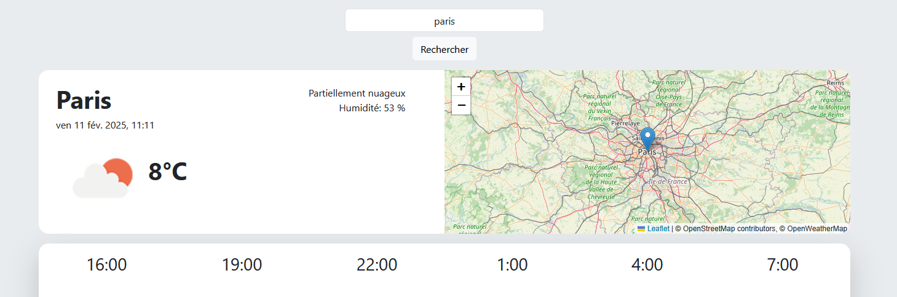

# MeteoApp

MeteoApp est une application météo simple qui vous permet de consulter les prévisions météorologiques pour différentes villes.

## Fonctionnalités

- Affichage des prévisions météorologiques sur le monde entier
- Recherche de villes par nom
- Affichage des prévisions sur plusieurs jours

## Mise à jour ##

### 28/06/2025
- MISE A JOUR :
    * Suppression de cartographie.
    * Grosse modification des fichiers en les rendant plus maintenable.

- PROCHAIN MISE A JOUR :
    * En pleine de réflexion de mettre de nouvelle fonctionnalité :
      * Une page concernant sur la différence des températures avant et après.
### 14/03/2025 : 
- MISE A JOUR : 
    * Ajout le prévision météo actuelle de votre ville.
        * Nom de la ville, le condition, l'humidité, icône.
        * Ajout le cartographie grâce à [OpenStreetMap](https://www.openstreetmap.org/) et [LeafletJS](https://leafletjs.com/)
        
    * Traduction tout les conditions en Français
- FIX :
    * Correction sur le problème d'affichage [Issues #5](https://github.com/YacineRAFES/MeteoApp/issues/5)

## Auteurs

- **Yacine RAFES** - *Concepteur Développeur d'Application* - [Mon Profil GitHub](https://github.com/YacineRAFES)